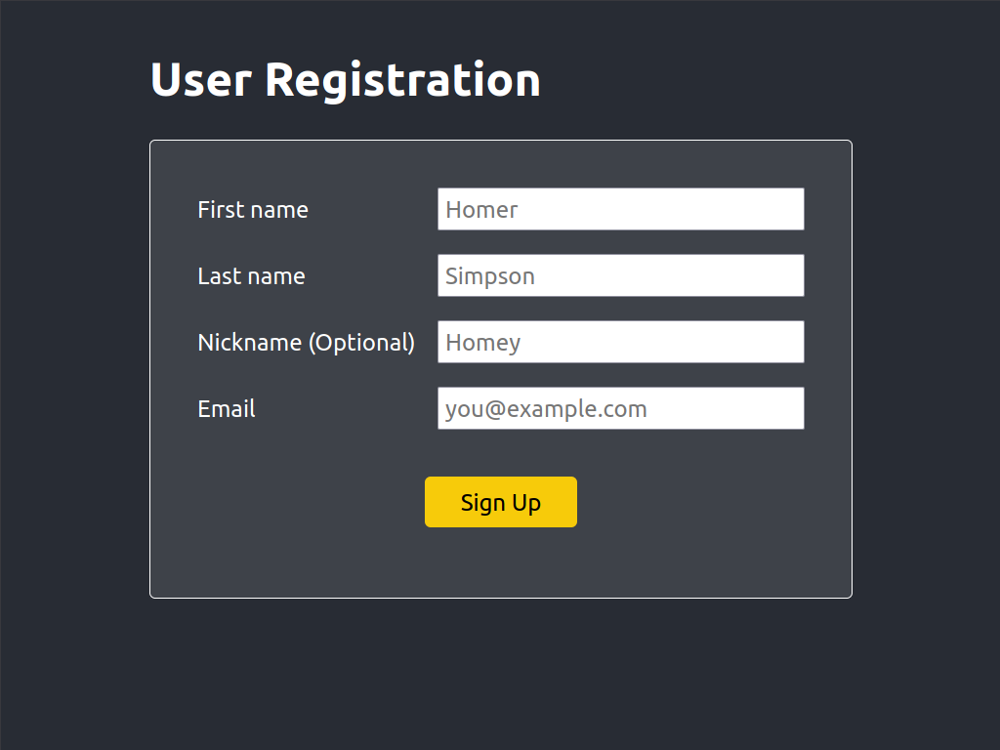
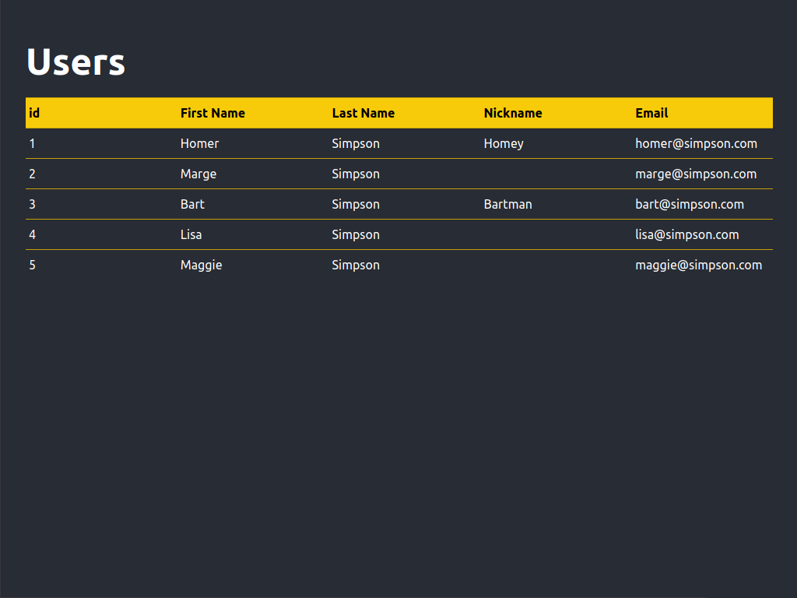

# Frontend Interview Exercise

## What to code

The exercise is to build a simple front-end web application that has two screens: a user sign-up form, and a user admin screen.  This should take you between 2-4 hours to complete.

Some sample screenshots have been provided but you are welcome to use your own design instead.  You do not need to create any custom graphics.  Feel free to utilize CSS frameworks if you prefer.

The user sign-up form should

- Accept the first name, last name, nickname, and email address
- Each of the inputs is required except nickname
- Validate the email - a simple rule that follows `x@y.z` format
- A submission should be rejected if the email address is already in use

The user admin screen should

- Display each user's info in a simple format.  You can use a table, cards, or anything else you'd like.

## Doing the exercise

This repo is based on the vanilla `create-react-app` template that is meant to help you get started, but feel free to use a different boilerplate or start with a clean slate.  You may also add additional NPM libraries as you like.  It is often just as important to be able to combine various open source libraries into a cohesive product.

It is preferred for you to complete this exercise using ReactJS, but if you are unfamiliar, you are also welcome to use other frameworks like Angular or Vue.

## Evaluation

Your implementation will be evaluated against the following criteria:

- it has to work
- cleanliness and readability of code
- creativity - It's great to show off interesting implementations, but stick to the objectives.  This exercise should not take too long, so don't feel the need to add extra features.